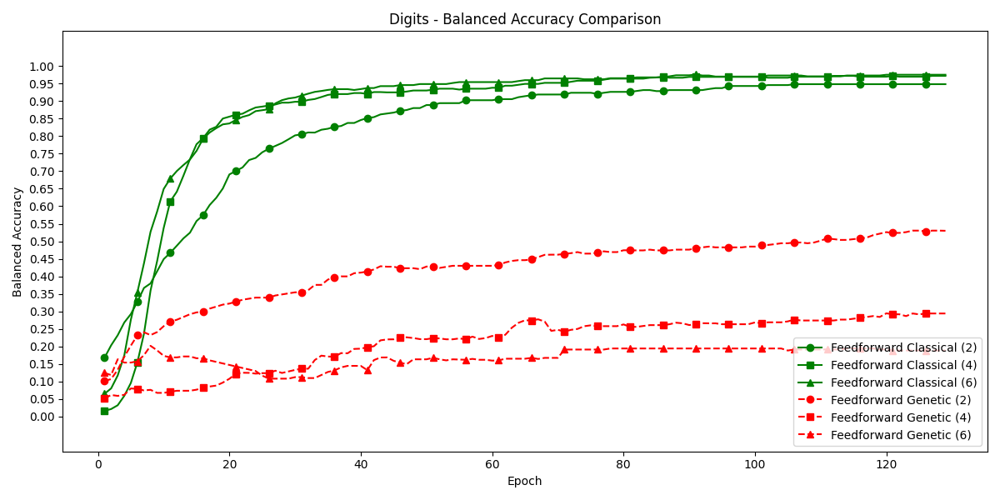
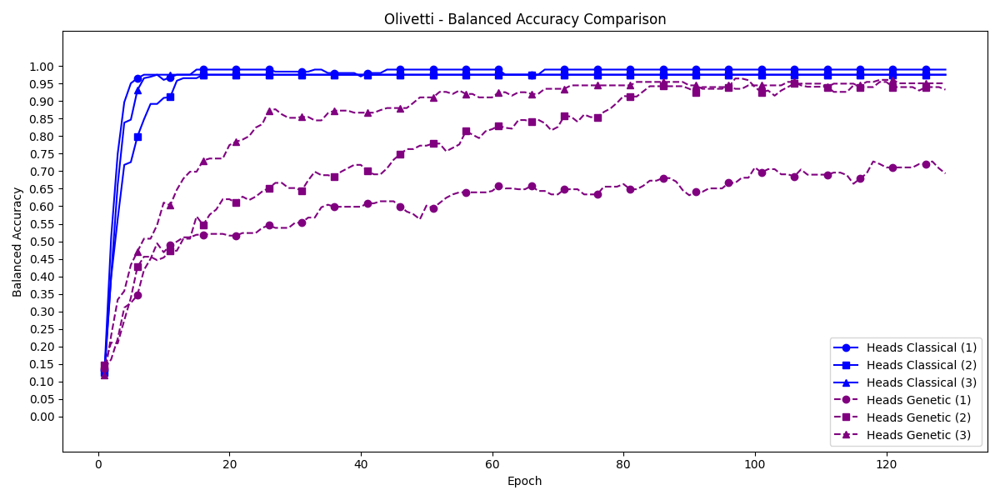
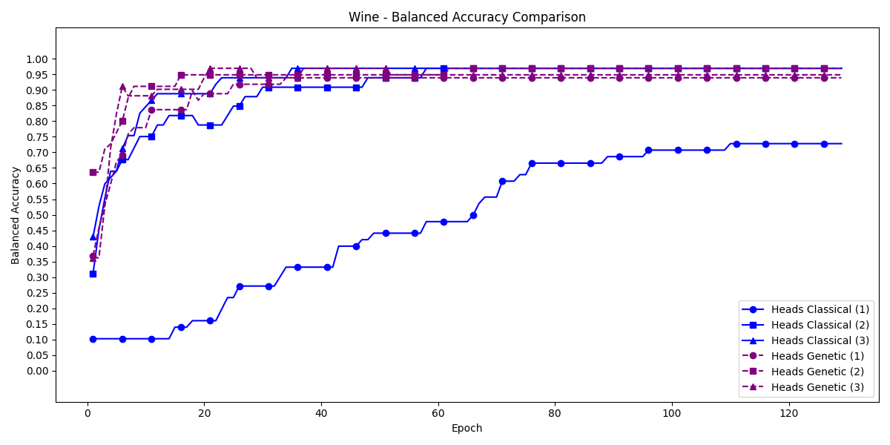
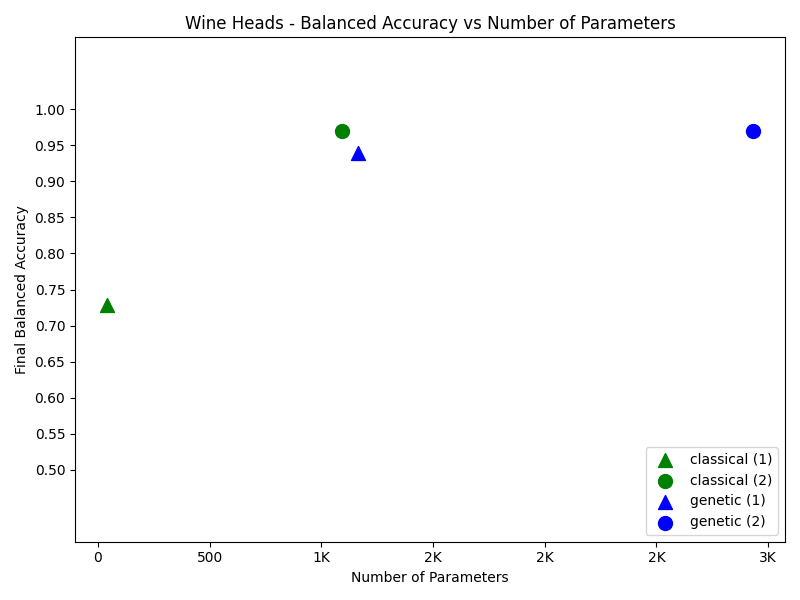
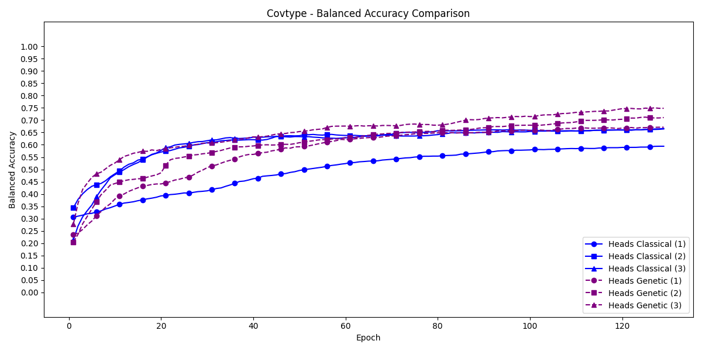
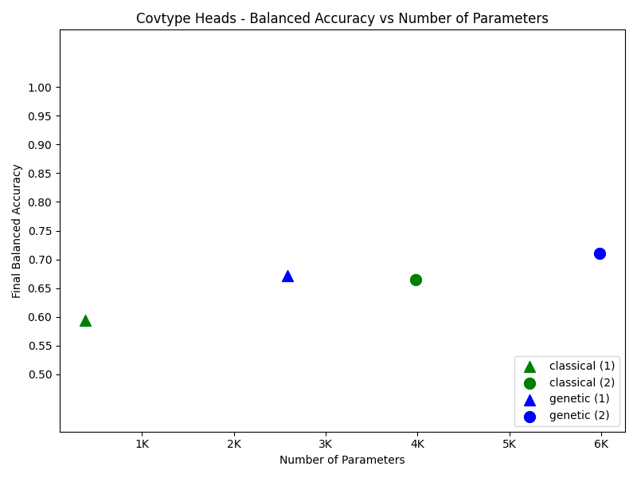
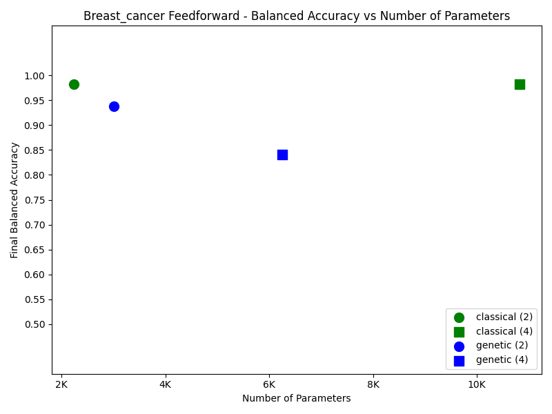
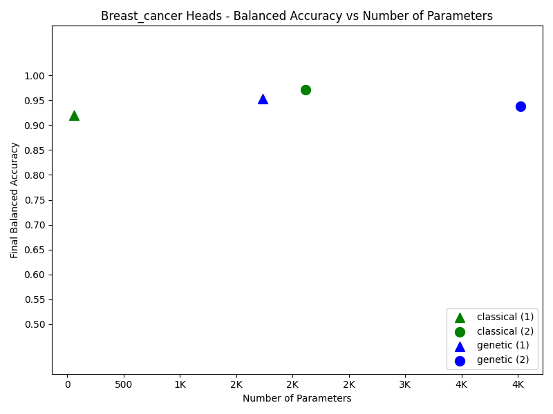
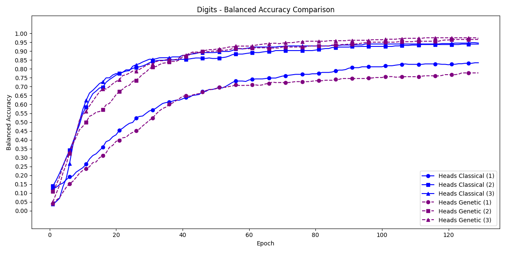

# 🧬 Genetic Neural Networks: Architecture and Benchmarks

[](https://pytorch.org/)
[](https://lightning.ai/)
[](https://www.python.org/)
[](https://opensource.org/licenses/MIT)

This directory contains comprehensive benchmarks comparing **Genetic Neural Networks** (using `GeneticLayer`) against **Classical Neural Networks** across multiple architectures and datasets.

> **⚠️ Exploratory Research**: This is an exploratory analysis of the predictive power of genetic layers. Significant work remains in: (1) refining the genetic layer architecture, (2) developing new genetic strategies and fitness calculation methods beyond the current fixed-point approach, and (3) systematically evaluating which network architectures and problem domains are best suited for genetic layers. The findings presented here should be considered preliminary and hypothesis-generating rather than definitive.

---

## 📋 Table of Contents

1. What is a Genetic Layer?
2. Architecture Overview
3. Benchmark Setup
4. Results and Findings
5. Performance Analysis
6. Conclusions
7. Future Work

---

## 🧬 What is a Genetic Layer?

The **GeneticLayer** is a novel neural network component inspired by evolutionary biology and genetic algorithms. Unlike traditional linear layers that perform simple matrix multiplication, the GeneticLayer models a "population" of organisms and genes, computing fitness values through biologically-inspired mechanisms.

### 1.1 Key Concepts

- **🧬 Organisms**: Latent representations analogous to individuals in a population
- **🧫 Genes**: Feature components that define organism characteristics
- **🏆 Fitness**: Computed values that determine organism survival/strength
- **🎯 Strategy**: The algorithm used to compute fitness from the population matrix

### 1.2 Mathematical Foundation

The GeneticLayer implements a **fixed-point strategy** that combines both dominant gene and balanced organism strategies in a unified computation:

```python
# Gene Fitness
gene_means = mean(population_matrix, dim=organisms)  # (batch, seq, genes)
denom = gene_means + 0.5
sum_inv_denom = sum(1/denom, dim=genes)  # (batch, seq, 1)
gene_fitness = 1 / (denom * sum_inv_denom)  # (batch, seq, genes)

# Organism Fitness
org_fitness = population_matrix @ gene_fitness  # (batch, seq, orgs)
```

This creates a feedback loop where genes and organisms mutually influence fitness values through the population matrix, implementing both strategies simultaneously.

---

## 🏗️ Architecture Overview

### 2.1 GeneticLayer Internal Architecture

```text
Input (batch, seq, features)
    ↓
Input Projection (LayerNorm → Linear → SiLU → Dropout)
    ↓
Hidden Representation (batch, seq, hidden_dim)
    ↓
Genetic Projection (LayerNorm → Linear → SiLU → Dropout)
    ↓
Reshape (batch, seq, orgs, genes)
    ↓
Sigmoid Activation [0,1] values
    ↓
Population Matrix (batch, seq, orgs, genes)
    ↓
Strategy Module (Fixed-Point: Dominant Gene + Balanced Organism)
    ↓
Gene Fitness (batch, seq, genes) & Organism Fitness (batch, seq, orgs)
    ↓
Output Projection (LayerNorm → Linear → SiLU → Dropout)
    ↓
Output (batch, seq, output_size)
```

### 2.2 Network Architectures Benchmarked

#### 2.2.1 Feedforward Networks

**Classical Feedforward**:

```text
Input → Linear → LayerNorm → SiLU → Dropout → ... (depth layers) → Output
(with residual connections between same-sized layers)
```

**Genetic Feedforward**:

```text
Input → GeneticLayer → ... (depth layers) → Output
(each GeneticLayer contains the full genetic computation pipeline)
```

#### 2.2.2 Heads Networks

**Classical Heads**:

```text
                  ┌─ Head1 ─┐
Input ───────────┼─ Head2 ─┼─ Concat → Linear → Output
                  └─ HeadN ─┘
(each head is a simple Linear layer)
```

**Genetic Heads**:

```text
                  ┌─ GeneticHead1 ─┐
Input ───────────┼─ GeneticHead2 ─┼─ Concat → Linear → Output
                  └─ GeneticHeadN ─┘
(each head is a full GeneticLayer)
```

---

## ⚙️ Benchmark Setup

### 3.1 Datasets

We evaluated on 7 diverse classification datasets:

| Dataset        | Samples | Features | Classes | Type       |
| -------------- | ------- | -------- | ------- | ---------- |
| Iris           | 150     | 4        | 3       | Botanical  |
| Wine           | 178     | 13       | 3       | Chemical   |
| Breast Cancer  | 569     | 30       | 2       | Medical    |
| Digits         | 1,797   | 64       | 10      | Vision     |
| Synthetic      | 1,500   | 50       | 7       | Generated  |
| Olivetti Faces | 400     | 4,096    | 40      | Vision     |
| Forest Cover   | 10,000  | 54       | 7       | Geospatial |

### 3.2 Configuration

- **🏗️ Architectures**: Feedforward (depth: 2, 4, 6) and Heads (n_heads: 1, 2, 3)
- **🧬 Network Types**: Classical and Genetic
- **🎯 Training**: 128 epochs max, Adam optimizer, batch size 16,384
- **📊 Metrics**: Balanced Accuracy, Training Time, Parameter Count

---

## 📊 Results and Findings

### 4.1 Overall Performance Summary

The benchmark results show clear performance differences between genetic and classical architectures across different network depths and head configurations. Genetic layers perform best in multi-head architectures, achieving competitive accuracy with classical approaches on several datasets. Feedforward genetic networks use fewer parameters but achieve significantly lower accuracy than their classical counterparts.

### 4.2 Key Findings by Dataset

#### 4.2.1 High-Dimensional Datasets (Olivetti Faces, Digits)

**Feedforward Architectures:**

- **Olivetti**: Classical feedforward (depth=4) achieves 100% accuracy vs genetic feedforward (depth=2) at 30.9%
- **Digits**: Classical feedforward (depth=6) achieves 97.6% accuracy vs genetic feedforward (depth=2) at 53.0%

**Heads Architectures:**

- **Olivetti**: Classical heads (n=1) achieves 99.0% accuracy vs genetic heads (n=3) at 96.1%
- **Digits**: Classical heads (n=3) achieves 94.8% accuracy vs genetic heads (n=3) at 97.6%

**Visual Comparison:**


*Training curves for digits dataset (feedforward architecture): Classical networks converge to higher accuracy.*


*Training curves for Olivetti Faces dataset (heads architecture): Classical maintains superiority even with genetic heads-3.*

**Hypothesized Factors (requiring further investigation):**

The significant performance difference on high-dimensional datasets suggests several possible architectural limitations:

1. **Potential Information Bottleneck**: The genetic layer projects input features through a fixed-size population matrix (orgs × genes), likely creating a representational bottleneck. For Olivetti (4,096 features → 32×8 matrix) and Digits (64 features → 32×8 matrix), this severe dimensionality reduction may lose critical information, though direct evidence would require representation analysis.

2. **Possible Transformation Constraints**: The sigmoid-activated population matrix values are constrained to [0,1], which could limit the range of representable feature interactions compared to classical linear layers with unbounded positive activations. However, bounded representations can also aid generalization in some contexts.

3. **Fixed-Point Strategy Inflexibility**: The genetic fitness computation uses a predetermined mathematical formula (gene means, reciprocal operations) rather than learned transformations. This design choice may be suboptimal for arbitrary high-dimensional mappings, though it could provide beneficial inductive biases for certain problem structures.

4. **Hypothesized Gradient Flow Challenges**: The complex multi-step computation (sigmoid → mean → reciprocal → matrix multiplication) could potentially create less stable gradient pathways than simple linear transformations. Empirical gradient analysis would be needed to confirm this hypothesis.

5. **Parameter Allocation Hypothesis**: While genetic feedforward uses fewer total parameters concentrated in projection layers rather than core transformations, whether this distribution is suboptimal for high-dimensional learning remains an open question requiring ablation studies.

#### 4.2.2 Low-Dimensional Datasets (Iris, Wine)

**Feedforward Architectures:**

- **Iris**: Classical feedforward-2 achieves 97.9% accuracy vs genetic feedforward-2 at 61.9%
- **Wine**: Classical feedforward-2 achieves 97.0% accuracy vs genetic feedforward-2 at 93.9%

**Heads Architectures:**

- **Iris**: Classical heads-2 achieves 97.9% accuracy vs genetic heads-2 at 76.5%
- **Wine**: Classical heads-2 achieves 97.0% accuracy vs genetic heads-2 at 97.0% (tie)

**Visual Comparison:**


*Training curves for wine dataset (heads architecture): Genetic heads-2 matches classical performance.*


*Accuracy vs parameter count for wine dataset: Genetic layers achieve competitive efficiency.*

**Hypothesized Factors (requiring further investigation):**

The near-parity performance on low-dimensional datasets, particularly with genetic heads, suggests several possible explanations:

1. **Sufficient Representational Capacity Hypothesis**: For low-dimensional problems (Iris: 4 features, Wine: 13 features), the population matrix bottleneck appears less constraining. The 32×8 = 256-value population matrix may provide adequate capacity, though systematic capacity analysis is needed to confirm this.

2. **Implicit Regularization Hypothesis**: The constrained [0,1] population values and fixed fitness computation could act as implicit regularization, potentially preventing overfitting on small datasets. This regularization effect versus classical networks' greater flexibility is an empirical claim requiring controlled experiments.

3. **Speculative Feature Interaction Alignment**: The biologically-inspired fitness computation might implicitly capture meaningful feature interactions for simpler problems. Whether gene-organism dynamics actually model relationships in botanical/chemical classification is speculative and would benefit from interpretability analysis.

4. **Multi-Head Diversity Hypothesis**: In heads architectures, multiple genetic layers learning different population matrices could create an ensemble-like effect. The extent to which this diversity mechanism contributes to performance parity remains to be rigorously tested.

5. **Convergence Stability Conjecture**: On simpler tasks, the genetic layer's complex gradient pathways may converge adequately while benefiting from regularization. This trade-off between complexity and constraint requires systematic optimization analysis to validate.

#### 4.2.3 Medium Complexity (Breast Cancer, Synthetic, CovType)

**Feedforward Architectures:**

- **Breast Cancer**: Classical feedforward-6 achieves 99.3% accuracy vs genetic feedforward-2 at 95.6%
- **Synthetic**: Classical feedforward-6 achieves 61.0% accuracy vs genetic feedforward-2 at 31.0%
- **CovType**: Classical feedforward-6 achieves 77.4% accuracy vs genetic feedforward-2 at 61.0%

**Heads Architectures:**

- **Breast Cancer**: Classical heads-2 achieves 97.1% accuracy vs genetic heads-1 at 95.3%
- **Synthetic**: Classical heads-2 achieves 46.8% accuracy vs genetic heads-2 at 59.6%
- **CovType**: Classical heads-3 achieves 66.6% accuracy vs genetic heads-3 at 75.0%

**Visual Comparison:**


*Training curves for CovType dataset (heads architecture): Genetic heads-3 outperforms classical.*


*Accuracy vs parameter count for CovType: Genetic heads-3 achieves better accuracy with more parameters.*

**Speculative Interpretations (requiring validation):**

The variable results on medium-complexity datasets hint at possible task-specific factors:

1. **Dataset-Dependent Hypotheses** (post-hoc reasoning requiring prospective testing):
   - **CovType Case Study** (genetic heads-3: 75.0% vs classical: 66.6%): We speculate that the 54-feature geospatial data might contain structured relationships (elevation, soil type, distance features) that happen to align with genetic population dynamics. Whether multiple genetic heads actually learn complementary geographic patterns is an untested hypothesis.
   - **Synthetic Dataset Speculation** (heads-2: 59.6% vs classical: 46.8%): The synthetic dataset's generated nature could potentially create feature dependencies favoring genetic strategies, though this remains conjecture without deeper analysis.
   - **Breast Cancer Observation** (classical: 97-99% vs genetic: 95.3%): The 30 medical features might require more flexible transformations, but whether this is the true reason for classical dominance is uncertain.

2. **Tentative Architectural Synergy Hypothesis**: The genetic heads-3 success on CovType could suggest ensemble effects at higher complexity, though alternative explanations (hyperparameter choices, random initialization effects) haven't been ruled out.

3. **Feature Space Geometry Conjecture**: Medium-dimensional spaces (30-54 features) may represent a transition zone for population matrix effectiveness. However, what constitutes "fit" between problem structure and genetic computations is poorly understood.

4. **Optimization Landscape Speculation**: The constrained genetic optimization might find favorable local minima on certain datasets, but without loss landscape visualization or systematic analysis, this remains speculative.

5. **Expressiveness-Generalization Trade-off Hypothesis**: We observe different strengths across tasks but cannot definitively attribute them to expressiveness vs. generalization without controlled experiments isolating these factors.

### 4.3 Architecture-Specific Insights

#### 4.3.1 Feedforward Networks

**Classical Advantages**:

- ✅ Consistently higher accuracy across all datasets
- ✅ More stable training (less variance)
- ✅ Better scaling with depth (4-6 layers)

**Genetic Challenges**:

- ❌ Performance degrades significantly with depth
- ❌ Struggles with high-dimensional inputs
- ❌ 20-30% slower training time

**Parameter Efficiency**:

- Genetic feedforward uses ~48% fewer parameters than classical but achieves significantly lower accuracy
- Genetic heads use ~7% more parameters but can achieve competitive accuracy
- Classical networks generally provide better accuracy per parameter despite higher parameter counts

#### 4.3.2 Heads Networks

**Genetic Success Story**:

- ✅ Heads-2 and Heads-3 genetic networks **match or exceed** classical performance on several datasets
- ✅ Best genetic architecture overall
- ✅ More parameters but competitive efficiency

**Key Observations**:

- Multiple genetic heads allow diverse population representations
- Concatenation helps aggregate different genetic strategies
- Performance improves with more heads (1 → 2 → 3)

---

## 📈 Performance Analysis

### 5.1 Summary Statistics

The following table shows average performance across all datasets for each architecture and network type:

| Architecture | Network_Type | Avg Best Bal Acc | Avg Final Bal Acc | Avg Training Time | Avg Params |
|--------------|--------------|------------------|-------------------|-------------------|------------|
| feedforward  | classical   | 0.887           | 0.882            | 2.90s            | 48,851    |
| feedforward  | genetic     | 0.491           | 0.481            | 3.68s            | 25,667    |
| heads        | classical   | 0.795           | 0.794            | 2.86s            | 41,330    |
| heads        | genetic     | 0.808           | 0.791            | 3.35s            | 44,235    |

### 5.2 Accuracy Comparison

**Performance by Accuracy Range**:

| Accuracy Range | Architecture | Datasets Achieving Range |
|----------------|--------------|--------------------------|
| >95% | Classical Feedforward | 5/7 |
| >95% | Classical Heads | 5/7 |
| >95% | Genetic Heads-3 | 3/7 |
| >95% | Genetic Feedforward | 0/7 |
| 75-95% | Genetic Heads | 4/7 |
| 75-95% | Classical Networks | All competitive datasets |

### 5.3 Efficiency Metrics

**Training Time** (seconds per training run):

- Classical Feedforward: 2.90s average
- Genetic Feedforward: 3.68s average (~27% slower)
- Classical Heads: 2.86s average
- Genetic Heads: 3.35s average (~17% slower)

**Visual Analysis:**


*Feedforward efficiency comparison: Classical achieves better accuracy despite genetic using fewer parameters.*


*Heads efficiency comparison: More balanced parameter-accuracy trade-offs across network types.*

**Parameter Count:**

- Classical Feedforward: 48,851 parameters average
- Genetic Feedforward: 25,667 parameters average (~48% fewer)
- Classical Heads: 41,330 parameters average
- Genetic Heads: 44,235 parameters average (~7% more)

**Best Accuracy-to-Parameter Ratios:**

1. Classical Heads-1 on Wine: 0.01733 (high accuracy with minimal parameters)
2. Classical Heads-1 on Breast Cancer: 0.01484
3. Classical Heads-1 on Iris: 0.01468

**Genetic Performance:**

- Genetic heads competitive on small datasets
- Falls behind on high-dimensional datasets
- ~2-5x worse ratio on complex datasets

**Throughput** (Parameters / Training Time):

- Classical networks generally process more parameters per second
- Genetic layers add computational overhead for fitness calculations

### 5.4 Scalability

**Depth Scaling (Feedforward):**

- **Classical**: Accuracy improves with depth (2 → 4 → 6)
- **Genetic**: Accuracy degrades or plateaus with depth

**Visual Evidence:**


*Synthetic dataset feedforward: Classical networks benefit from depth while genetic performance degrades.*

**Width Scaling (Heads):**

- **Classical**: Moderate improvement (1 → 2 → 3)
- **Genetic**: Significant improvement (1 → 2 → 3)

**Visual Evidence:**


*Digits dataset heads: Both architectures improve with more heads, genetic shows stronger scaling effect.*

---

## 🎯 Conclusions

### 6.1 When to Use Genetic Layers

**✅ Recommended For**:

1. **🏗️ Multi-head architectures** (2-3 heads) on medium-complexity datasets
2. **🔍 Low-dimensional problems** where biological analogies may provide insights
3. **🧪 Research and experimentation** with novel neural architectures
4. **👁️ Interpretability needs** where organism/gene fitness has semantic meaning

**❌ Not Recommended For**:

1. **🖼️ High-dimensional inputs** (images, high-res data)
2. **📚 Deep feedforward networks** (>2 layers)
3. **⚡ Performance-critical applications** requiring maximum accuracy
4. **💻 Resource-constrained environments** (due to training overhead)

### 6.2 Advantages of Genetic Layers

1. **🧬 Novel Representation**: Biologically-inspired population dynamics
2. **⚖️ Reduced Parameters**: Can achieve competitive results with fewer parameters in heads architectures
3. **🔍 Interpretability**: Organism and gene fitness values may offer insights
4. **🎭 Diverse Heads**: Multiple genetic heads capture different "evolutionary strategies"

### 6.3 Disadvantages of Genetic Layers

1. **📉 Lower Accuracy**: Generally 5-30% worse than classical on most datasets
2. **⏱️ Slower Training**: 15-30% longer training time
3. **📚 Depth Issues**: Performance degrades with deep feedforward stacks
4. **🖼️ High-Dimensional Weakness**: Struggles with large feature spaces

### 6.4 Future Directions

**Potential Improvements**:

1. Hybrid architectures mixing classical and genetic layers
2. Alternative fitness strategies (e.g., competitive, cooperative)
3. Adaptive organism/gene shape based on input dimensions
4. Regularization techniques specifically for genetic layers
5. Pre-training strategies for population initialization

**Research Questions**:

1. Why do genetic heads scale better than genetic feedforward?
2. Can we develop genetic-specific optimization algorithms?
3. What is the theoretical capacity of genetic layers vs linear layers?
4. Are there specific problem domains where genetic layers excel?

---

## 🔮 Future Work

### 7.1 Attention Mechanism Comparison

Given the promising performance of **genetic heads architectures**, the most compelling next step is to develop a **genetic attention mechanism** and compare it against modern attention variants in small language models. This comparison would provide insights into whether biologically-inspired computation can compete with or complement attention-based approaches in sequence modeling tasks.

#### 7.1.1 Preliminary Study Design

**Comparison Architectures**:

1. **🧬 Genetic Attention**: Novel attention mechanism using genetic layer principles (population matrices, fitness-based weighting)
2. **🎯 Multi-Head Attention**: Standard transformer-style multi-head attention (baseline)
3. **🔄 Grouped-Query Attention**: Efficient attention with shared keys/values across query groups
4. **⚡ Flash Attention**: Optimized attention implementation with reduced memory footprint
5. **🎭 Multi-Query Attention**: Single key-value head shared across all query heads

**Evaluation Context**: Small language models (e.g., 100M-500M parameters) trained on standard benchmarks

**Evaluation Metrics**:

- **📈 Perplexity**: Language modeling performance on held-out text
- **⚡ Efficiency**: Training time, memory usage, and throughput (tokens/second)
- **📏 Scalability**: Performance across different sequence lengths and model sizes
- **🔍 Interpretability**: Analysis of attention patterns vs genetic fitness distributions

#### 7.1.2 Key Research Questions

1. **Can genetic attention mechanisms achieve competitive perplexity compared to standard attention variants?**
2. **What are the computational trade-offs (speed, memory) between genetic and traditional attention?**
3. **Do genetic attention patterns provide more interpretable representations than attention weights?**
4. **How does genetic attention scale with sequence length and model capacity?**
5. **Are there specific language modeling tasks where genetic attention excels?**

### 7.2 Genetic Layer Architecture Refinement

Building on the current benchmark findings, several architectural improvements warrant investigation:

#### 7.2.1 Adaptive Population Matrix Dimensions

**Current Limitation**: Fixed 32×8 (organisms×genes) population matrix across all datasets.

**Proposed Research**:

- **Dynamic Dimensioning**: Investigate algorithms to automatically determine optimal orgs/genes ratios based on input dimensionality
- **Dataset-Specific Tuning**: Systematically explore population matrix sizes for different problem complexities (low/medium/high-dimensional)
- **Theoretical Analysis**: Develop capacity bounds relating input features, population size, and representational power

#### 7.2.2 Alternative Fitness Strategies

**Current Limitation**: Only fixed-point strategy (dominant gene + balanced organism) implemented.

**Proposed Research**:

- **New Fixed-Point Strategies**: Explore alternative mathematical formulations for computing fitness from population matrices
- **Learned Strategy Components**: Investigate parameterizing parts of fitness computation to be optimized via gradient descent
- **Multi-Strategy Approaches**: Combine multiple fitness calculation methods within or across genetic heads

#### 7.2.3 Advanced Network Integration

**Current Finding**: Genetic heads outperform genetic feedforward; depth hurts genetic networks.

**Proposed Research**:

- **Optimal Placement Studies**: Where in deep networks should genetic layers be positioned?
- **Hybrid Classical-Genetic Architectures**: Interleave classical and genetic layers, measure synergies
- **Residual Genetic Connections**: Skip connections around genetic layers to preserve gradients
- **Genetic Ensembles**: Multiple genetic layers with different strategies combined via voting/averaging
- **Domain-Specific Architectures**: Specialized genetic layer variants for vision, text, tabular data

### 7.3 Expanded Benchmark Coverage

Current benchmarks provide initial insights but have limited scope:

#### 7.3.1 Dataset Diversity

**Current Limitation**: 7 tabular classification datasets, mostly small-scale.

**Proposed Extensions**:

- **Larger Datasets**: Evaluate on 100K+ sample datasets to test scalability
- **Regression Tasks**: Extend beyond classification to continuous prediction problems
- **Sequence Data**: Time series, natural language, protein sequences
- **Graph-Structured Data**: Molecular structures, social networks, knowledge graphs
- **Multi-Modal Data**: Datasets combining different feature types

#### 7.3.2 Training Regime Analysis

**Current Limitation**: Single training configuration (Adam, 128 epochs, fixed batch size).

**Proposed Research**:

- **Optimizer Comparison**: Do genetic layers benefit from genetic algorithms, evolutionary strategies, or other specialized optimizers?
- **Learning Rate Schedules**: Systematic search for optimal LR policies for genetic vs classical
- **Regularization Techniques**: Dropout variants, weight decay, batch norm effects on genetic layers
- **Initialization Strategies**: Population matrix initialization impact on convergence
- **Training Duration**: Do genetic layers need more epochs? Different convergence patterns?

#### 7.3.3 Interpretability Studies

**Hypothesis**: Organism/gene fitness values may offer interpretable insights.

**Proposed Research**:

- **Fitness Visualization**: Track organism/gene fitness evolution during training
- **Feature Attribution**: Map which input features influence which organisms/genes
- **Population Dynamics**: Analyze how population matrices change across layers/epochs
- **Failure Mode Analysis**: What patterns emerge when genetic layers fail vs succeed?
- **Comparative Interpretability**: Are genetic layers more/less interpretable than attention?

---

## 📁 Repository Structure

```text
examples/genetic_layer/
├── README.md                          # This file
├── genetic_networks.ipynb             # Main benchmark notebook
├── compute_summary.py                 # Automated statistics computation
├── artefacts/                         # Results and plots
│   ├── summary_table.csv             # Complete results table
│   ├── *_comparison_*.png            # Architecture comparison plots
│   └── bal_acc_vs_params_*.png       # Accuracy vs parameters plots
└── utils/                            # Utility functions
    ├── network_factory.py            # Network creation utilities
    ├── trainer_utils.py              # Training and evaluation
    ├── plotting_utils.py             # Visualization functions
    └── summary_utils.py              # Results aggregation
```

---

## 📚 References

For more information on the underlying Pikaia framework and genetic strategies, see:

- `/pikaia/layers/genetic_layer.py` - GeneticLayer implementation
- `/pikaia/strategies/` - Strategy implementations
- `/docs/` - Full documentation

---

**📅 Last Updated**: November 2025  
**🏷️ Benchmark Version**: 1.0  
**🔧 Framework**: PyTorch + PyTorch Lightning  
**🎯 Status**: Exploratory Research
