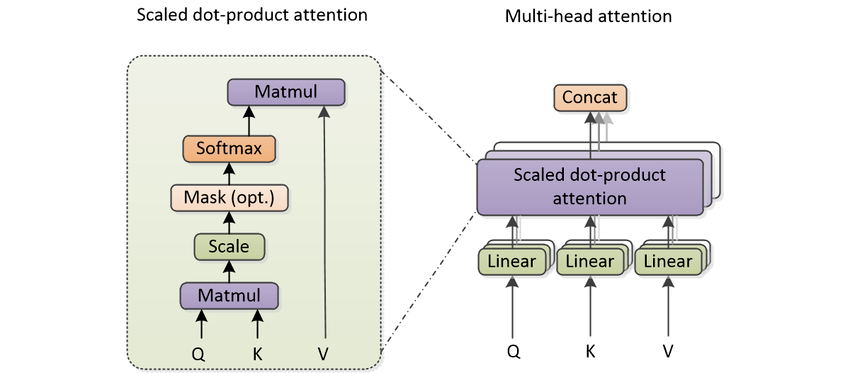

# Hybrid AI

This document highlights areas of machine learning where genetic sorting could replace traditional components. The document is divided into sections based on the aspects of machine learning models that could benefit from genetic sorting techniques.

## 1. Large Language Models (LLMs)

### 1.1. Attention Mechanisms

The attention mechanism is a core component of transformer-based LLMs, whose purpose is to update token embeddings so that they capture contextual information more effectively.

Well-known attention mechanisms include Scaled Dot-Product Attention, Multi-Head Attention (MHA), Grouped-Query Attention (GQA), Multi-Head Latent Attention (MLA), and Gated DeltaNet.

The quadratic-scaling mechanisms (Scaled Dot-Product, MHA, GQA, MLA) can benefit from Sliding Window Attention (SWA) to improve efficiency for long contexts.

Genetic sorting could be used to create novel attention mechanisms that optimize the weighting of token interactions based on evolutionary principles.

We will review each attention mechanism before we try to define a genetic sorting-based alternative.

### 1.1.1. Scaled Dot-Product Attention

Scaled Dot-Product Attention is the fundamental building block of attention mechanisms in transformers.

Given input embeddings $X \in \mathbb{R}^{(B \times T \times D)}$, where $B$ is batch size, $T$ is sequence length, and $D$ is embedding dimension, it computes attention weights that determine how much focus each position should place on others.

The process involves:

1. **Input Projections**: Queries (Q), Keys (K), and Values (V) are obtained by linear projections of the input embeddings:

   - $Q = XW^Q \in \mathbb{R}^{(B \times T \times D)}$
   - $K = XW^K \in \mathbb{R}^{(B \times T \times D)}$
   - $V = XW^V \in \mathbb{R}^{(B \times T \times D)}$

   Where $W^Q, W^K, W^V \in \mathbb{R}^{(D \times D)}$ are learned projection matrices.

2. **Optional QK Normalization**: Modern attention mechanisms often normalize Q and K before computing scores:

   - **RMSNorm**: $Q' = \text{RMSNorm}(Q)$, $K' = \text{RMSNorm}(K)$
   - **L2 Norm**: $Q' = \frac{Q}{\|Q\|_2}$, $K' = \frac{K}{\|K\|_2}$

   This stabilizes training and improves model quality, especially in large models (used in Gemma, Qwen, etc.)

3. **Attention Scores**: Compute scaled dot-product similarity between queries and keys:
   $$ \text{scores} = \frac{Q'K'^T}{\sqrt{D}} \in \mathbb{R}^{(B \times T \times T)} $$

   The scaling by $\sqrt{D}$ prevents the dot products from growing too large.

4. **Softmax Normalization**: Apply softmax along the key dimension to get attention weights:
   $$ \text{weights} = \text{softmax}(\text{scores}) \in \mathbb{R}^{(B \times T \times T)} $$

   Where softmax normalizes each row to sum to 1.

5. **Weighted Sum**: Compute the output by weighting the values:
   $$ \text{output} = \text{weights} \cdot V \in \mathbb{R}^{(B \times T \times D)} $$

For causal attention (autoregressive decoding), a mask is applied to the scores before softmax to prevent attending to future tokens.

The complete formula is:

$$ \text{Attention}(Q, K, V) = \text{softmax}\left(\frac{QK^T}{\sqrt{D}}\right) V $$

### 1.1.2. Multi-Head Attention (MHA)

Multi-Head Attention (MHA) extends scaled dot-product attention by running multiple attention heads in parallel, each operating on different learned subspaces of the input embeddings.

Given input embeddings $X \in \mathbb{R}^{(B \times T \times D)}$, where $B$ is batch size, $T$ is sequence length, $D$ is embedding dimension, and $h$ is the number of heads:

The process involves:

1. **Linear Projections**: Project the input into multiple sets of Q, K, V for $h$ heads:

   - For each head $i$: $Q_i = XW_i^Q$, $K_i = XW_i^K$, $V_i = XW_i^V$
   - Where $W_i^Q, W_i^K, W_i^V \in \mathbb{R}^{(D \times d_{\text{head}})}$ with $d_{\text{head}} = \frac{D}{h}$
   - This gives $Q_i, K_i, V_i \in \mathbb{R}^{(B \times T \times d_{\text{head}})}$
   - **Note**: QK normalization (if used) is applied per-head before computing attention

2. **Multi-Head Computation**: Compute attention for each head independently:
   $$ \text{head}_i = \text{Attention}(Q_i, K_i, V_i) \in \mathbb{R}^{(B \times T \times d_{\text{head}})} $$

3. **Concatenation**: Concatenate the outputs from all heads:
   $$ \text{Concat}(\text{head}\_1, \dots, \text{head}\_h) \in \mathbb{R}^{(B \times T \times D)} $$

4. **Output Projection**: Apply a final linear projection:
   $$ \text{MHA}(X) = \text{Concat}(\text{head}\_1, \dots, \text{head}\_h) W^O \in \mathbb{R}^{(B \times T \times D)} $$

   Where $W^O \in \mathbb{R}^{(D \times D)}$ is the output projection matrix.

The complete formula is:

$$ \text{MHA}(X) = \text{Concat}(\text{head}\_1, \dots, \text{head}\_h) W^O $$

Where each $\text{head}_i = \text{Attention}(XW_i^Q, XW_i^K, XW_i^V)$.



### 1.1.3. Grouped-Query Attention (GQA)

Grouped-Query Attention (GQA) is a variant of multi-head attention that reduces memory and computational cost by using fewer key-value heads than query heads. Multiple query heads share the same key-value heads.

Given input embeddings $X \in \mathbb{R}^{(B \times T \times D)}$, where $B$ is batch size, $T$ is sequence length, $D$ is embedding dimension:

Let $h_q$ be the number of query heads and $h_{kv}$ be the number of key-value heads, where $h_{kv} < h_q$ and $h_q$ is divisible by $h_{kv}$.

The process:

1. **Grouping**: Each KV head serves $g = \frac{h_q}{h_{kv}}$ query heads.

2. **Projections**:

   - Query projections: $Q_i = XW_i^Q$ for $i = 1, \dots, h_q$, giving $Q_i \in \mathbb{R}^{(B \times T \times d_{\text{head}})}$
   - Key-value projections: $K_j = XW_j^K$ and $V_j = XW_j^V$ for $j = 1, \dots, h_{kv}$, giving $K_j, V_j \in \mathbb{R}^{(B \times T \times d_{\text{head}})}$
   - Where $d_{\text{head}} = \frac{D}{h_q}$

3. **Grouped Attention**: For each KV head $j$ (where $j = 1, \dots, h_{kv}$):

   - Determine which query heads belong to this group
   - The group contains query heads from index $(j-1) \cdot g + 1$ through $j \cdot g$
   - Example: If $g=4$ (4 query heads per KV head):
     - KV head 1 ($j=1$) serves query heads 1-4
     - KV head 2 ($j=2$) serves query heads 5-8
     - KV head 3 ($j=3$) serves query heads 9-12, etc.
   - All query heads in the group share the same $K_j, V_j$
   - Compute attention for each query head $i$ in the group:

   $$ \text{head}_i = \text{softmax}\left(\frac{Q_i K_j^T}{\sqrt{d_{\text{head}}}}\right) V_j $$

4. **Concatenation and Output**: Same as MHA, concatenate all $h_q$ query head outputs and apply output projection:

   $$ \text{GQA}(X) = \text{Concat}(\text{head}_1, \dots, \text{head}_{h_q}) W^O \in \mathbb{R}^{(B \times T \times D)} $$


### 1.1.4. Multi-Head Latent Attention (MLA)

Multi-Head Latent Attention (MLA) compresses the keys and values into a lower-dimensional latent space to reduce KV cache memory usage during inference. Instead of caching separate K and V tensors for each head, MLA caches a single compressed representation.

Given input embeddings $X \in \mathbb{R}^{(B \times T \times D)}$, where $B$ is batch size, $T$ is sequence length, $D$ is embedding dimension, and $h$ is the number of heads:

The process:

1. **Compression to Latent Space**: Project input to create a shared compressed representation:

   - Compute compressed KV representation: $C^{KV} = XW^{KV} \in \mathbb{R}^{(B \times T \times d_c)}$
   - Where $W^{KV} \in \mathbb{R}^{(D \times d_c)}$ and $d_c \ll D$ (typically $d_c \approx \frac{D}{4}$ to $\frac{D}{8}$)
   - **What gets cached**: Store $C^{KV}$ in the KV cache (total: $d_c$ per token)
   - **Key difference from MHA**: MHA caches separate K and V for all heads (total: $2D$ per token)

2. **Per-Head Projections**: For each head $i$, expand from the shared compressed representation:

   - Keys: $K_i = C^{KV} W_i^K \in \mathbb{R}^{(B \times T \times d_{\text{head}})}$ where $W_i^K \in \mathbb{R}^{(d_c \times d_{\text{head}})}$
   - Values: $V_i = C^{KV} W_i^V \in \mathbb{R}^{(B \times T \times d_{\text{head}})}$ where $W_i^V \in \mathbb{R}^{(d_c \times d_{\text{head}})}$
   - Queries (full-dimensional): $Q_i = XW_i^Q \in \mathbb{R}^{(B \times T \times d_{\text{head}})}$ where $W_i^Q \in \mathbb{R}^{(D \times d_{\text{head}})}$
   - Where $d_{\text{head}} = \frac{D}{h}$
   - The per-head $K_i, V_i$ are computed on-the-fly and not cached

3. **Multi-Head Attention**: Compute attention for each head:
   $$ \text{head}_i = \text{softmax}\left(\frac{Q_i K_i^T}{\sqrt{d_{\text{head}}}}\right) V_i $$

4. **Concatenation and Output**: Concatenate all heads and apply output projection:
   $$ \text{MLA}(X) = \text{Concat}(\text{head}\_1, \dots, \text{head}\_h) W^O \in \mathbb{R}^{(B \times T \times D)} $$

**Memory Savings**: During inference, the KV cache stores only $C^{KV} \in \mathbb{R}^{(B \times T \times d_c)}$ (total: $d_c$ per token) instead of separate $K, V \in \mathbb{R}^{(B \times T \times D)}$ (total: $2D$ per token). The cache compression ratio is $\frac{d_c}{2D}$, typically achieving 4-8× memory reduction. The per-head $K_i, V_i$ are computed on-demand from the cached compressed representation during each forward pass.


### 1.1.5. Sliding Window Attention (SWA)

Sliding Window Attention (SWA) restricts the attention mechanism to consider only a fixed window of tokens around each position, making it efficient for long sequences by reducing the quadratic complexity of full attention.

Given input embeddings $X \in \mathbb{R}^{(B \times T \times D)}$, where $B$ is batch size, $T$ is sequence length, $D$ is embedding dimension, and window size $w$:

The process:

1. **Window Definition**: For each position $i$ in the sequence, define the attention window:

   - For causal (autoregressive) models: positions $[\max(0, i - w), i]$
   - For bidirectional models: positions $[\max(0, i - w), \min(T-1, i + w)]$

2. **Standard Projections**: Compute Q, K, V as in regular attention:

   - $Q = XW^Q$, $K = XW^K$, $V = XW^V \in \mathbb{R}^{(B \times T \times D)}$

3. **Masked Computation**: Compute attention scores with a window mask:

   $$
   \text{scores}_{ij} = \begin{cases}
   \frac{Q_i \cdot K_j^T}{\sqrt{D}} & \text{if } |i-j| \leq w \\
   -\infty & \text{otherwise}
   \end{cases}
   $$

   Where $\text{scores} \in \mathbb{R}^{(B \times T \times T)}$

4. **Normalization and Output**: Apply softmax and compute weighted sum:
   $$ \text{output}_i = \sum_{j \in \text{window}(i)} \text{softmax}(\text{scores}\_i)\_j \cdot V_j $$

This local attention pattern reduces computation from $\mathcal{O}(T^2)$ to $\mathcal{O}(T \cdot w)$, where $w \ll T$.


### 1.1.6. Gated DeltaNet

Gated DeltaNet is a linear attention mechanism that scales linearly with the context length, offering an alternative to the quadratic complexity of traditional attention. It draws inspiration from recurrent neural networks and incorporates a gating mechanism similar to Mamba-style architectures.

#### Understanding Quadratic vs Linear Complexity

**Why Traditional Attention is Quadratic ($\mathcal{O}(T^2)$)**:

In standard attention, computing the output requires:

1. **Computing attention scores**: For each query position $i$, compute similarity with all key positions $j$:
   $$\text{scores}_{ij} = \frac{Q_i K_j^T}{\sqrt{D}} \quad \text{for all } i, j \in [1, T]$$

   This creates a $T \times T$ attention matrix.

2. **For each of $T$ queries**, we compute attention over **all $T$ keys**: $T \times T = T^2$ operations.

**Example**: For a sequence of length $T = 1000$:

- Standard attention: $1000 \times 1000 = 1,000,000$ attention score computations
- Memory for attention matrix: $T^2 = 1,000,000$ values
- For $T = 10,000$: $100,000,000$ computations (100× more)
- For $T = 100,000$: $10,000,000,000$ computations (10,000× more!)

This quadratic scaling makes long contexts prohibitively expensive.

**Why Linear Attention is Linear ($\mathcal{O}(T)$)**:

Linear attention reorders the computation using associativity of matrix multiplication:

Standard attention:
$$\text{Attention}(Q, K, V) = \text{softmax}(QK^T)V$$

This computes $(QK^T)$ first (creates $T \times T$ matrix), then multiplies by $V$.

Linear attention reorders:
$$\text{LinearAttention}(Q, K, V) = \phi(Q) \left( \phi(K)^T V \right)$$

Key insight: Compute $(K^T V)$ first, which creates a $D \times D$ matrix (size independent of $T$!), then multiply by $Q$.

**Example**: For sequence length $T = 1000$ and dimension $D = 64$:

Traditional attention:

- Step 1: $Q \times K^T$ creates $(1000 \times 64) \times (64 \times 1000) = (1000 \times 1000)$ matrix
- Step 2: $(1000 \times 1000) \times (1000 \times 64) = (1000 \times 64)$ output
- **Total operations**: $\mathcal{O}(T^2 D) = 64,000,000$

Linear attention:

- Step 1: $K^T \times V$ creates $(64 \times 1000) \times (1000 \times 64) = (64 \times 64)$ matrix
- Step 2: $Q \times (64 \times 64)$ creates $(1000 \times 64) \times (64 \times 64) = (1000 \times 64)$ output
- **Total operations**: $\mathcal{O}(T D^2) = 4,096,000$ (16× less!)

For $T = 100,000$: Linear attention uses 100× less computation than standard attention.

**The Trade-off**: Linear attention requires a feature map $\phi$ that approximates softmax. This approximation means linear attention is less expressive than full attention, which is why hybrid architectures (mixing linear and quadratic attention) are effective.

#### Gated DeltaNet Architecture

Linear attention variants like Gated DeltaNet are used in models such as Qwen3-Next and Kimi Linear, which employ a hybrid approach: for every three transformer blocks using linear Gated DeltaNet attention, there is one block with full quadratic attention. This hybrid design balances efficiency and expressiveness.

**Multi-Head Structure**: Like standard attention mechanisms, Gated DeltaNet uses multiple heads (e.g., $h=32$). Each head projects the full $D$-dimensional embedding into its own $d_{\text{head}}$-dimensional subspace ($d_{\text{head}} = D/h$) using learned weight matrices $W_i^Q, W_i^K, W_i^V \in \mathbb{R}^{D \times d_{\text{head}}}$. This allows different heads to learn complementary representations and attend to different semantic aspects. The linear complexity $\mathcal{O}(T \cdot d_{\text{head}}^2)$ applies per-head, making the overall computation $\mathcal{O}(h \cdot T \cdot d_{\text{head}}^2) = \mathcal{O}(T D^2)$.

**Core Components**:

1. **Convolutional Preprocessing**: Before linear attention, apply 1D causal convolutions to capture local patterns:

   - **Input/Output**: $X \in \mathbb{R}^{(B \times T \times D)} \rightarrow X_{\text{conv}} \in \mathbb{R}^{(B \times T \times D)}$
   - **Purpose**: Captures short-range dependencies in a fixed local window (complementary to attention's global view)
   - **Kernel size**: Typically small (e.g., $k=4$), meaning each output depends on only 4 consecutive input positions

   **How causal convolution works**:

   For a token at position $t$ with kernel size $k=4$:

   ```text
   Position:     [..., t-3, t-2, t-1, t]
   Weights:           w₃   w₂   w₁  w₀
   Output:       x_conv[t] = w₀·x[t] + w₁·x[t-1] + w₂·x[t-2] + w₃·x[t-3]
   ```

   The key property: each output position $t$ depends only on current and previous positions $[t-k+1, \dots, t]$, ensuring no "future peeking". This maintains causality for autoregressive generation.

   **Why Convolutions?**: The convolutions provide:

   - Local context aggregation (complements global linear attention)
   - Positional awareness without explicit position embeddings
   - Better gradient flow for training stability
   - Inductive bias that helps the model learn faster

2. **Linear Attention Computation**:
   $$ \text{LinearAttention}(Q, K, V) = \phi(Q) \left( \phi(K)^T V \right) $$

   Where $\phi$ is a feature map that makes the attention scores positive (often exponential: $\phi(x) = \exp(x)$).

3. **Gating Mechanism** (DeltaNet's key innovation):
   - Compute gate values: $\beta = \sigma(X_{\text{conv}} W^{\beta}) \in [0, 1]^{(B \times T \times D)}$
   - Apply decay to the accumulated state at each step:
     $$ S*t = \beta_t \odot S*{t-1} + \phi(K_t) V_t^T $$
   - Output: $O_t = \phi(Q_t) S_t$
   - **Channel-wise gating** (Kimi Linear): Separate $\beta$ for each feature dimension provides fine-grained control
   - This allows selective forgetting/remembering of information, similar to LSTM gates


**Complexity Comparison**:

- Standard Attention: $\mathcal{O}(T^2 D)$ time, $\mathcal{O}(T^2)$ memory
- Gated DeltaNet: $\mathcal{O}(T D^2)$ time, $\mathcal{O}(D^2)$ memory
- For typical LLMs where $T \gg D$, this is a massive improvement

### 1.1.7. Multi-Head Genetic Attention (MGA)

Multi-Head Genetic Attention (MGA) is a novel attention mechanism that follows the classical Multi-Head Attention (MHA) pipeline but applies genetic sorting to modulate attention weights based on evolutionary fitness principles.

#### Genetic Fitness Scores

The genetic fitness scores \(\gamma_j^{*}\) are computed as:

\[
\gamma_j^{*} \;=\; \left( \sum_{s=1}^{m}
\frac{\widetilde{\Phi}_j + \tfrac{1}{2}}{\widetilde{\Phi}_s + \tfrac{1}{2}}
\right)^{-1}, \qquad \forall j\in\{1,\dots,m\}.
\]

where \(\gamma_j^{*}\) is the gene fitness score for gene \(j\), and \(\widetilde{\Phi}_j\) is the gene average across organisms for gene \(j\).

Given input embeddings $X \in \mathbb{R}^{(B \times T \times D)}$, where $B$ is batch size, $T$ is sequence length, $D$ is embedding dimension, and $h$ is the number of heads:

The process follows a novel genetic attention formulation:

1. **Value Projection**: Project inputs to Values (V) only:
   - $V = XW^V \in \mathbb{R}^{(B \times T \times D)}$
   - Reshape to heads: $V \in \mathbb{R}^{(B \times h \times T \times d_{\text{head}})}$

2. **Genetic Attention Matrix Construction**: Construct attention matrices from V:
   - For each head, create matrices of shape $(T \times T \times d_{\text{head}})$ where invalid positions (future tokens or outside sliding window) are masked to zeros
   - This results in $V_{\text{masked}} \in \mathbb{R}^{(B \times h \times T \times T \times d_{\text{head}})}$

3. **Genetic Sorting**: Apply genetic sorting to each $(T \times d_{\text{head}})$ matrix:
   - For each batch, head, and query position $i$, treat the $(T \times d_{\text{head}})$ matrix as a population of organisms (rows) and genes (columns)
   - Compute organism fitness values $G_{ij} \in \mathbb{R}^{(B \times h \times T \times T)}$ using genetic sorting

4. **Normalization and Softmax**: Normalize and apply softmax to fitness scores:
   - $\text{weights} = \text{softmax}(G) \in \mathbb{R}^{(B \times h \times T \times T)}$

5. **Weighted Sum**: Compute final output by weighting values:
   - $\text{output} = \text{weights} \cdot V \in \mathbb{R}^{(B \times h \times T \times d_{\text{head}})}$

#### Key Differences from Standard Attention

- **Value-Only Projections**: Only computes Value projections, eliminating Query-Key interactions
- **Genetic Matrix Construction**: Builds attention matrices directly from Value embeddings with masking
- **Organism Fitness Computation**: Uses genetic sorting to compute fitness scores for each token pair
- **Direct Fitness Weighting**: Attention weights are derived directly from genetic fitness scores

#### Variants and Optimizations

MGA supports several advanced optimizations:

- **Grouped-Query Attention (GQA)**: Uses fewer value heads ($h_v < h$) to reduce memory bandwidth
- **Multi-Head Latent Attention (MLA)**: Compresses inputs into a low-rank latent space before projection
- **Gated DeltaNet Integration**: Applies gating mechanism to the output

This mechanism offers a biologically inspired alternative to standard attention, potentially capturing different contextual relationships through evolutionary fitness evaluation.

### 1.2. Mixture of Experts (MoE)

Mixture of Experts (MoE) is a sparse model architecture that divides the model's capacity into multiple specialized sub-networks called "experts." Instead of using all parameters for every input, MoE dynamically selects and activates only a subset of experts based on the input, enabling efficient scaling to very large models.

In transformer-based LLMs, MoE is commonly applied to the feed-forward networks (FFNs), replacing the dense FFN with a sparse MoE layer. Each expert is typically a small MLP, and a routing mechanism determines which experts process each token.

The routing is performed by a gating network that computes scores for each expert:

$$ g(x) = \text{softmax}(W_g x) $$

For each input token $x$, the $\top_k$ experts with the highest scores are selected. The final output is a weighted sum of the selected experts' outputs:

$$ \text{MoE}(x) = \sum\_{i \in \top_k} g_i(x) \cdot \text{Expert}\_i(x) $$

To prevent load imbalance where some experts are overused, auxiliary losses are added to encourage even distribution of tokens across experts.

MoE architectures often include a "shared expert" that processes all tokens, combined with the routed sparse experts. This hybrid approach maintains some dense computation while benefiting from sparsity.


MoE enables models with trillions of parameters to be trained and deployed efficiently, as only a fraction of the model is activated per token during inference.

### 1.2.1. Genetic Router (TBD)

A Genetic Router can replace the learned gating network with a genetic selection mechanism. In this framework, the available experts are treated as a population of organisms, and the input token represents the environment.

The process involves:

1. **Expert Embeddings**: Each expert $E_j$ is associated with a representative embedding $G_j$.
2. **Fitness Evaluation**: For a given input token $x$, we calculate the fitness of each expert.
3. **Selection**: The top-$k$ fittest experts are selected to process the token.
